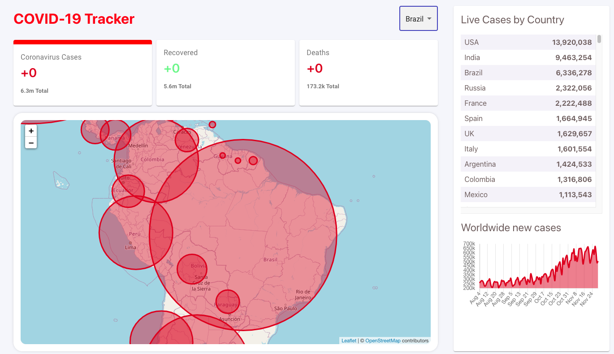

<h1 align="center">Covid 19 - Tracker </h1>

 

   <a href="#-technologies">Technologies</a>&nbsp;&nbsp;&nbsp;|&nbsp;&nbsp;&nbsp;
   <a href="#-project">Project</a>&nbsp;&nbsp;&nbsp;&nbsp;&nbsp;&nbsp;
 

 

    
 

 ## :rocket: Technologies

 A covid-19 cases tracker developed using ReactJs, the following technologies were used on this project:

 - [ReactJS](https://reactjs.orgm)
 - [Material UI](https://material-ui.com/pt/)
 - [Firebase](https://firebase.google.com) - for hosting 
 - [Leaflet](https://leafletjs.com)
 - [Chart.js](https://www.chartjs.org)

 ## 💻 Project

Wanna see a live version ? Check it out: [Covid Tracker](https://covidtracker-1cf2c.web.app/).

 ---
<h4 align="center">
   Code and coffee ☕
</h4>
